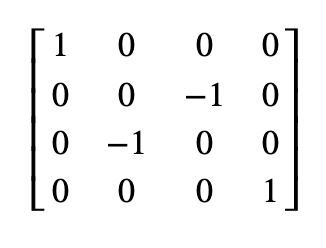

# QOSF Mentorship 2020

Thanks for taking time to view my solution for the task! Details regarding the implementation of this task is contained in the Jupyter notebook - `vqe.ipynb`. (All hand drawn images are my own! :))

## QOSF Mentorship 2020 Application Task 4 Overview

Task 4 had applicants create a VQE (Variational Quantum Eigensolver) circuit from scratch. With this home-made VQE circuit applicants must find the lowest eigenvalue state of the following matrix:




## Task Structure 

The source code for the VQE in contained entirely in `vqe.py` with the supplemental conceptual overview as well as implementation notes contained in `vqe.ipynb`. I also created an additional library called `optimizer.py` in order to experiment with classical optimizers in the context of VQE. 

The Jupyter notebooks covers the following topics:
1. Concepts and implementation of the VQE Circuit
2. Notes and thoughts on Python implementation
3. Experimenting with classical optimizers and noise models
4. Where do we go from here? (Questions and topics to explore)

A `requirements.txt` file is also included in this repository to install the small amount of Python dependencies, necessary for running the VQE algorithm. 

```
DEPENDENCIES
-----
qiskit>=0.20.1
numpy>=1.19.2
scikit-quant>=0.7.0
matplotlib>=3.3.2
```